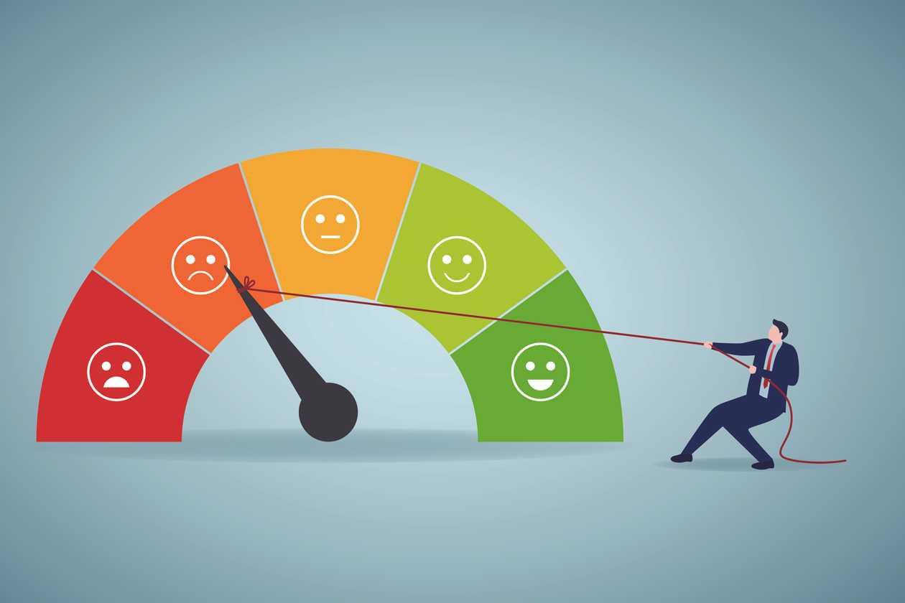

```{r logo1, echo=FALSE, out.width= "35%", out.extra='style="float:left; padding:10px"'}

library(fontawesome)
knitr::include_graphics("erg3.svg")
```

We are an organizational consulting group staffed by Industrial and Organizational Psychologists. Our philosophy is based on the concept of a local handyman - we apply Behavioral Science methods through a lens of experience and common sense to develop creative business solutions. All provided services are delivered within the systems-oriented framework of Organizational Development (e.g., taking careful consideration of unintended consequences).

## Enhancing Employee Experience at Work

Our expertise includes business process automation and survey creation, administration, and feedback. One of the features that makes us unique is that all of our solutions are fully powered by [`r icons::fontawesome("r-project")`](https://www.r-project.org/about.html).

## Services Provided:  

```{r logo2, echo=FALSE, out.width= "45%", out.extra='style="float:right; padding:10px"'}

```

+ Replacing existing functions with more [efficient   processes](https://ergreports.com/automation/)
+ Building and sustaining [engaged workforces](https://ergreports.com/workforce-engagement/)  
+ Assisting with the building, administration, and interpretation of organizational polling (aka surveys)
