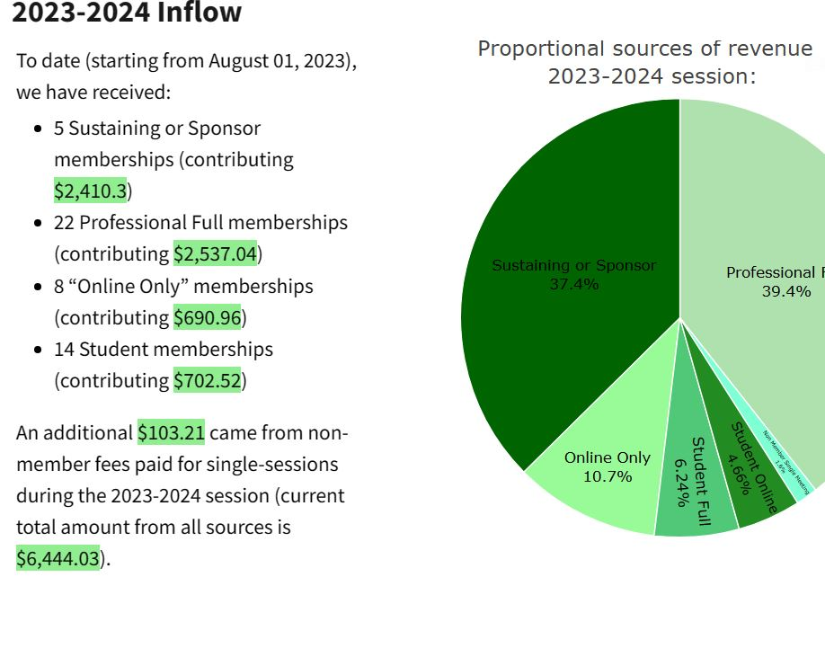

## Process automation `r emo::ji("rocket")`

We help organizations transition from legacy functions to more efficient (often automated) work processes. For processes that involve data management of some type, [we build solutions](borcelle.png) via `r icons::fontawesome("r-project")`, because it is:  

+ Powerful  
+ Flexible  
+ Cost-effective  
  
We use the platform to scrape data from websites, automate reports, and consolidate data into centralized repositories. The transition framework that we apply is broadly applicable - your business processes are of course unique but can very likely be automated via application of our standard principles of efficiency. Repetitive Excel actions, for example, are common every day business applications that we can help you automate. This frees employees to focus their time on more important and less tedious tasks.

### Process Automation Example #1{#DataViz}

A local nonprofit organization had a financial reporting process that required the: 1) accessing of information from multiple accounts, 2) manual transfer of account transactions, and 3) report generation (including qualitative descriptions of finances).  

```{r MPPAW, echo=FALSE, out.width= "35%", out.extra='style="float:right; padding:10px"'}


```

The automation here "cut out" the second and third components of this process. Because this data is financial in nature, the organization still requires an appointed representative to *access* the information, but there is no human involvement beyond accessing the financial files. A partially redacted[^foot] version of the new automated reporting document [can be accessed here](Report.html). 

### Process Automation Example #2 

## Teaching `r icons::fontawesome("r-project")`

If you are interested in training your personnel on `r icons::fontawesome("r-project")` so that you may develop your own `r icons::fontawesome("r-project")`-powered business processes and products, we also provide training on "how to use" `r icons::fontawesome("r-project")` - just [drop us a note](https://ergreports.com/our-team/#contact).  

[^foot]: the financial information available in the report is publicly available and represents only an example snapshot of financial records